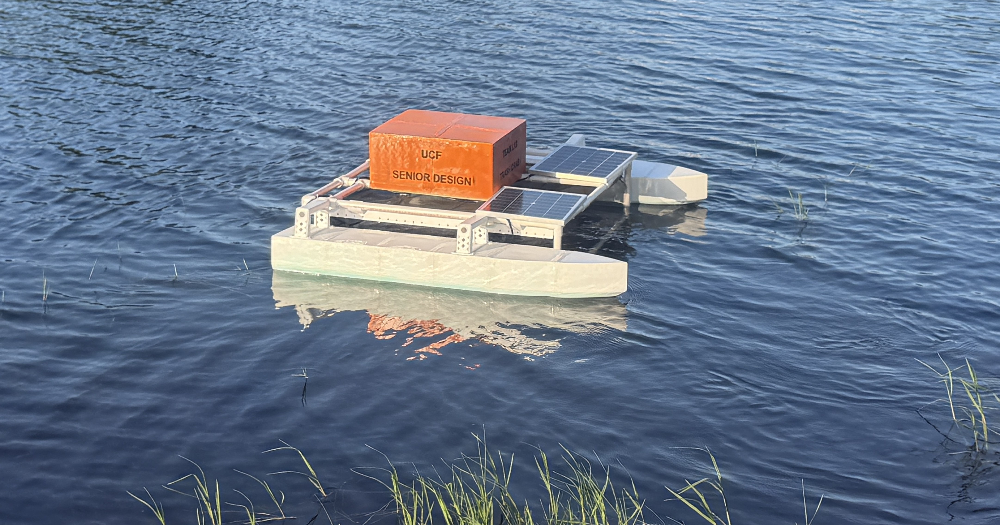

<p align="center">
  
</p>

<h1 align="center">The Trash Crab</h1>

<p align="center">
  An open-source, low-cost, tele-operated surface vehicle for collecting floating debris in lakes, ponds, and other calm freshwater bodies.
</p>

## About

Marine debris is a serious problem for wildlife, and there's no real affordable, mobile, wildlife-safe way to actively collect floating trash in small bodies of water. Shore crews can't reach open water, stationary filters only cover a fixed area, and pump-based systems risk harming aquatic life.

Trash Crab is our attempt at an answer: a solar-assisted, remote-controlled catamaran raft with a forward-facing mesh collection basket. An operator deploys the boat, drives it to intercept floating debris, and brings it back to empty the basket and recharge. The whole project (hardware, firmware, dashboard software, and 3D models) is published here so it can be built, used, and improved by others.

This project was built by Group L13 as a Computer Science Senior Design project at the University of Central Florida during the Spring/Summer 2026 semesters.

## Features

- **Remote tele-operation** over a long-range (~30 km) radio link, with WASD driving controls and a hardware-backed emergency stop
- **Live web dashboard** (React + MapLibre) showing GPS position and heading, connection status, and drive telemetry in real time
- **Automatic failsafe**: the boat stops itself if it loses contact with the operator
- **GPS tracking** with live position and heading shown on an interactive map
- **Onboard trash detection** using a fine-tuned YOLOv8n model running on a Luxonis OAK-D Lite stereo camera
- **Fully 3D-printed hull and basket**: STL/3MF files included for anyone who wants to build their own
- Designed around a bill of materials of roughly **$1,000-$1,300**, aiming to keep replication relatively affordable

## How it works

```
          Laptop (operator)                        Raspberry Pi 5 (onboard)
 +----------------------------------+   radio   +---------------------------+
 | React dashboard (Vite)           | <-------> | pi-side_telecom_server.py |
 |         |                        |  (LoRa)   |         |                 |
 |         v                        |           |         v                 |
 | dashboard-side_telecom_server.py |           | Arduino Nano (motors)     |
 |      (Flask)                     |           | VK-162 GPS (USB)          |
 |         |                        |           | OAK-D Lite (CV, planned)  |
 |         v                        |           +---------------------------+
 | COM port / radio dongle          |
 +----------------------------------+
```

- The dashboard sends drive commands (`W`/`A`/`S`/`D`) and an emergency stop to a small Flask server running locally on the operator's laptop, which forwards them over the radio link.
- The Raspberry Pi on the boat receives those commands, converts them into left/right motor speeds, and passes them to an Arduino Nano over serial, which handles the actual motor PWM.
- The Pi also reads GPS fixes from a USB GPS dongle and sends a telemetry packet back over the radio once a second (position, elapsed time, connection status, sensor placeholders).
- If the Pi stops receiving commands for more than a second, it cuts the motors on its own rather than waiting for another STOP command.

## Repository structure

```
trash-crab/
├── my-react-app/                       # Dashboard: React frontend + Flask telecom bridge
│   ├── src/                            # Dashboard UI (controls, live stats, map view)
│   ├── dashboard-side_telecom_server.py
│   └── requirements.txt
├── trash-crab-pi/                      # Code that runs on the Raspberry Pi
│   ├── pi-side_telecom_server.py
│   ├── arduino-motor-controller.ino    # Flashed onto the Arduino Nano
│   ├── startup-crab.service            # systemd unit for launching on boot
│   └── requirements.txt
└── stl-files/                          # 3D-printable hull, basket, and mount parts
```

## Hardware overview

| Vessel | Catamaran-style raft, ~36" L x 48" W x 20" H, forward mesh collection basket |
|---|---|
| Capacity | ~70 gallon basket volume |
| Speed / Range | 0.5–1 m/s / up to ~30 km on the radio link |
| Runtime | 4–6 hours per charge, extended by onboard solar panels (~12–15 hrs to recharge) |

| Layer | Hardware |
|---|---|
| Main computer | Raspberry Pi 5 (Python, headless) |
| Low-level motor control | Arduino Nano running [`arduino-motor-controller.ino`](trash-crab-pi/arduino-motor-controller.ino) (C++, PWM over serial) |
| Navigation | VK-162 USB GPS module |
| Radio link | LoRa LR900-F data transmit module |
| Vision | Luxonis OAK-D Lite (stereo camera + onboard NPU) |

3D-printable parts for the hulls, collection basket, thruster mounts, and component enclosure are in [`stl-files/`](stl-files/).

## Machine learning

Floating debris detection runs on a YOLOv8n model, fine-tuned on the FloW-A dataset (floating waste in inland waterways, ICCV 2021) using the Ultralytics training framework. It reached an mAP@0.5 of 0.873 with an 84% true positive detection rate on validation data, and is small enough to run in real time on the OAK-D Lite's onboard NPU. Obstacle detection and a basket-fullness estimator (OpenCV frame analysis) were designed alongside it; obstacle detection is still waiting on a training dataset before it can ship.

## Getting started

You'll need two things running: the code on the Raspberry Pi (boat side) and the dashboard on your laptop (operator side). They talk to each other over a matched pair of radio modules: one plugged into the Pi, one plugged into the laptop.

### Prerequisites

- Raspberry Pi 5 with Python 3.9+, wired to an Arduino Nano, a VK-162 GPS dongle, and a radio module
- The Arduino Nano flashed with [`arduino-motor-controller.ino`](trash-crab-pi/arduino-motor-controller.ino) (steps below, right from the Pi's terminal)
- A laptop with [Node.js](https://nodejs.org/) 18+ and Python 3.9+, with a matching radio module plugged in
- Both Python environments need their own virtual environment (recommended) and dependencies from the matching `requirements.txt`
- [Git](https://git-scm.com/) 2.25+ on both machines, to clone just the folder each one needs

### 1. Raspberry Pi setup

```bash
mkdir trash-crab && cd trash-crab
git clone --filter=blob:none --sparse https://github.com/alcehmystic/trash-crab.git .
git sparse-checkout set trash-crab-pi
cd trash-crab-pi
python -m venv .venv
source .venv/bin/activate
pip install -r requirements.txt
```

#### Flashing the Arduino Nano

This uses [arduino-cli](https://arduino.github.io/arduino-cli/), so the Nano can be flashed straight from the Pi's terminal with the Nano plugged in over USB, no separate desktop or GUI IDE needed. Install it once, along with the AVR core and the `Servo` library the sketch needs:

```bash
curl -fsSL https://raw.githubusercontent.com/arduino/arduino-cli/master/install.sh | sh
sudo mv bin/arduino-cli /usr/local/bin/
arduino-cli core update-index
arduino-cli core install arduino:avr
arduino-cli lib install Servo
```

Arduino sketches must live in a folder with the same name as the `.ino` file, so copy it into one, then compile and upload:

```bash
mkdir arduino-motor-controller
cp arduino-motor-controller.ino arduino-motor-controller/
arduino-cli compile --fqbn arduino:avr:nano arduino-motor-controller
arduino-cli upload -p /dev/ttyUSB0 --fqbn arduino:avr:nano arduino-motor-controller
```

Run `arduino-cli board list` first if you're not sure which port the Nano shows up as. This only needs to be redone if `arduino-motor-controller.ino` changes.

Before running `pi-side_telecom_server.py`, open it and check the **CONFIGURATION** block near the top of the file. It lists the serial ports for the radio, the Arduino, and the GPS dongle. The defaults match our own Pi, but yours will likely enumerate differently. Run `ls -l /dev/serial/by-id/` on the Pi to find the correct by-id names for your own devices and swap them in.

```bash
python pi-side_telecom_server.py
```

#### Starting automatically on boot

[`startup-crab.service`](trash-crab-pi/startup-crab.service) is a systemd unit that launches `pi-side_telecom_server.py` on boot, so the boat is ready to drive as soon as the Pi powers on, with no monitor, keyboard, or WiFi needed. Edit the `WorkingDirectory` and `ExecStart` paths inside it to match where you cloned the repo on your own Pi, then install it:

```bash
sudo cp startup-crab.service /etc/systemd/system/
sudo systemctl daemon-reload
sudo systemctl enable --now startup-crab.service
```

Check on it with `systemctl status startup-crab.service`, or watch its logs live with `journalctl -u startup-crab.service -f`.

### 2. Dashboard setup

```bash
mkdir trash-crab && cd trash-crab
git clone --filter=blob:none --sparse https://github.com/alcehmystic/trash-crab.git .
git sparse-checkout set my-react-app
cd my-react-app
npm install
python -m venv .venv
source .venv/bin/activate
pip install -r requirements.txt
```

Open `dashboard-side_telecom_server.py` and set `PORT` (near the top of the file) to whatever COM port your radio adapter shows up as (Device Manager on Windows, or `/dev/tty*` on Mac/Linux).

```bash
npm run dev
```

This starts the Vite dev server and the telecom bridge together. The program is ran entirely offline. Open `http://localhost:5173` in a browser to see the dashboard. If you'd rather run them separately, use `npm run dev:frontend` and `npm run dev:telecom` in two terminals.

### Getting the whole repository

The steps above only pull down the one folder each device needs. If you want everything at once instead, including the [`stl-files/`](stl-files/) for 3D printing your own parts, just do a normal full clone:

```bash
git clone https://github.com/alcehmystic/trash-crab.git
cd trash-crab
```

## Bill of materials

Rough parts list and cost for building your own Trash Crab. Prices are estimates and will shift depending on suppliers and substitutions. Some parts are noted with a brand due to components being sized around them.

| Category | Component(s) |
|---|---|
| Compute / Control | Raspberry Pi 5 (8GB) x1, Arduino Nano x1 |
| Sensors & Navigation | VK-162 GPS (w/ or w/o magnetometer) x1, MPU6050 IMU x3, leak sensor x4 |
| Propulsion | 12V brushless underwater thrusters w/ESC x4 (We used DIAMONDDYNAMICS 1.2kg Thrust model) |
| Structure & Hull | PETG filament (~9-10kg, depending on print settings), 3/4" PVC pipe for the frame (40-45 ft, cut to length), PVC fittings (8x 3-piece corner connectors, 8x 3-piece T connectors) |
| Waterproofing | Marine silicone sealant 10oz x2 (for hulls, frame, and box) |
| Power System | 12.8V 100Ah LiFePO4 battery x1 (DEASON), 20W solar panel w/charge hub x2 (SOLPERK), power distribution board x1, 12v to 5v/5A Buck Converter to USB-C x1, wiring and adapters |
| Communications | MicoAir LoRa LR900-F radio data transmit module x1 |

**Estimated total: $900-$1,200**, depending on part pricing and substitutions.

## Team

| Name | Role |
|---|---|
| Benedetto Falin | Hardware Construction / SCRUM Manager |
| Kevin Fernandez | Hardware Construction |
| Robert Botorog | Machine Learning / Computer Vision |
| Kameron Hyles | Machine Learning / Computer Vision |
| Hailey Kristona | Software / GUI |
| Phuong Trinh Le | Software / GUI |

## License

This project is licensed under the [MIT License](LICENSE).
