# Trash Crab Assembly Manual

This is the build guide for the Trash Crab's hull, frame, basket, and components box. It covers physical assembly only. For flashing the Arduino and running the software, see the [main README](../README.md).

Before starting, print all the parts listed in [`stl-files/`](../stl-files/) and gather the materials in the [Bill of materials](../README.md#bill-of-materials).

The build goes in six stages, roughly in the order you'll actually want to do them:

1. [Assemble the hulls](#1-assemble-the-hulls)
2. [Cut and assemble the PVC frame](#2-cut-and-assemble-the-pvc-frame)
3. [Mount the hulls to the frame](#3-mount-the-hulls-to-the-frame)
4. [Build and mount the basket rails](#4-build-and-mount-the-basket-rails)
5. [Cut and fold the basket netting](#5-cut-and-fold-the-basket-netting)
6. [Assemble the components box and finish](#6-assemble-the-components-box-and-finish)

## 1. Assemble the hulls

Each hull is printed as six segments (bow, four middle modules, stern) that key together with alignment pins before being joined permanently. You'll build two identical hulls.

Lay the six segments out in order and dry-fit them so the alignment pins line up before committing to glue or sealant.

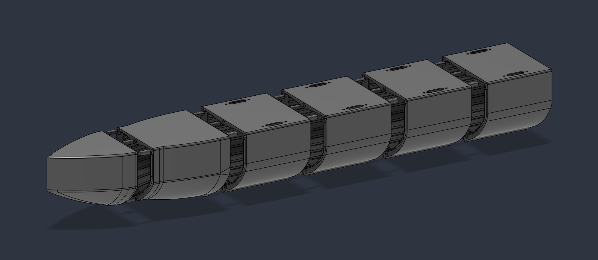

Each hull gets two carry grips, attached via four 1/2" #10x32 non-countersunk bolts. These should be hand tightened and not overdone. These must be added before gluing, as there is no way to access the nut after the hulls are sealed.

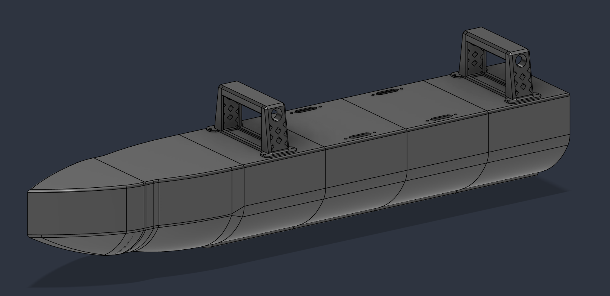

Apply marine silicone adhesive sealant to each seam, as well as a small dollop on the dowel-pin's hole, and join the segments end to end. This is best done by stacking the hull pieces vertically, with the back catamaran module on the floor, pressing down firmly so sealant seeps out along the edges. Apply a ream of silicone sealant along this outer seam and smooth with a brush or finger (gloved) to create a cleaner seal.

The extra top holes for additional/optional handles can be sealed as well if they are not desired.

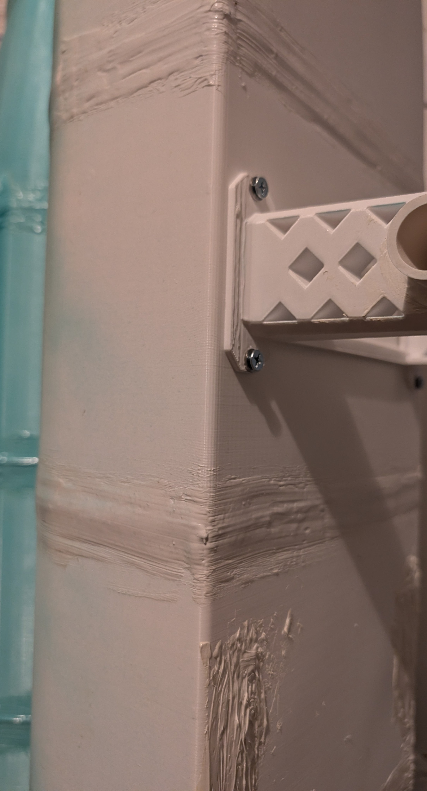

Repeat this whole stage for the second hull.

## 2. Cut and assemble the PVC frame

The frame is made from 3/4" Schedule 40 PVC, cut to the lengths below and joined with standard PVC 3-piece corner and T connectors.

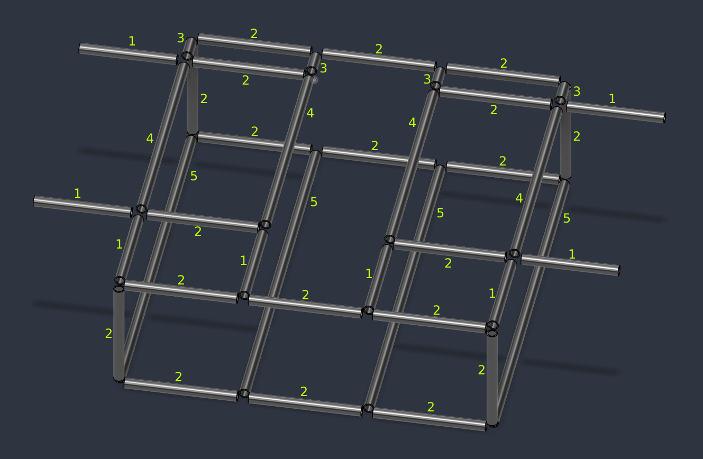

Cut list (numbers correspond to the labels above; double check against the diagram before cutting):

| Length | Count | Label |
|---|---|---|
| 9.5" | x8 | (1) |
| 11" | x20 | (2) |
| 2.25" | x4 | (3) |
| 22" | x4 | (4) |
| 37" | x4 | (5) |

**Total: ~45 ft of pipe in total.**

Dry-fit the whole frame with the 3-piece corner and T connectors before gluing anything, to confirm square and fit. We used the same marine silicone adhesive sealant to glue the frame, but any water-safe and flexible PVC glue should work fine.

## 3. Mount the hulls to the frame

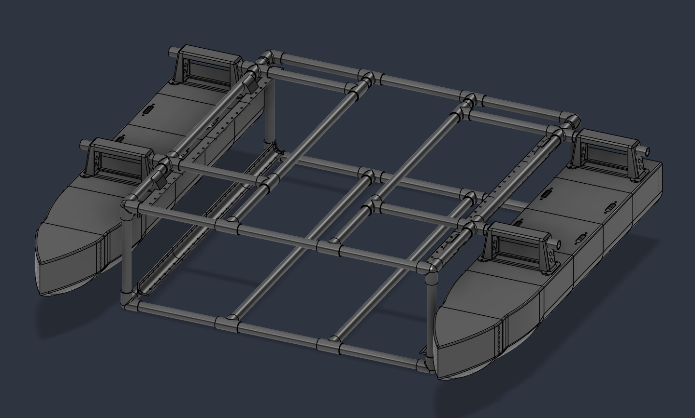

Each hull gets two of the 9.5" PVC pieces from the frame through the handle grips. This will be a tight fit depending on your printer's tolerances, so be careful not to crack the handles. The pipes should stick out (in the direction of the hull's mounting side) no less than 1" from the handle. Any less, and it risks not fully seating into the frame's cross connection. Aim for 1" - 1.5" so the hull can rest against the frame without sagging. Mirror this direction on the opposite hull as seen above.

Once tested for proper fitting, some glue can be used to lock the PVC pipe to the hull handle grip. Do not seal the PVC pipe to the frame connection, unless you do not want them to be removable.

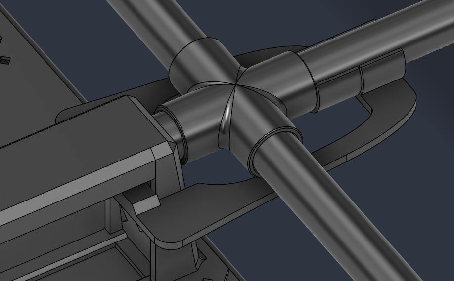

Each hull also gets one hull grip clamp. These are bent and placed around the inside of the handle grips, clipping onto the inside PVC frame to ensure the hulls do not slip out of their connection during usage. Before any significant stress is placed on the hulls, the hull grip clamps should be placed and verified for strength.

## 4. Build and mount the basket rails

The basket rails run along the inside of the frame and hold the netting via zip-ties through the provided holes.

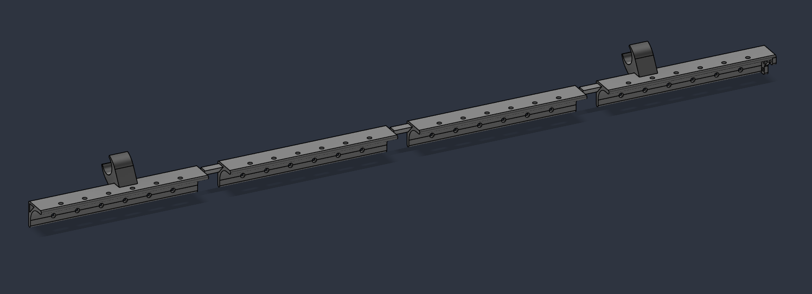

Join the four rail segments with the triangle-pin connectors with a ream of the marine silicone adhesive sealant on their joining faces to ensure they do not come apart. Note the C-clip hook at each end, used later to hold the netting.

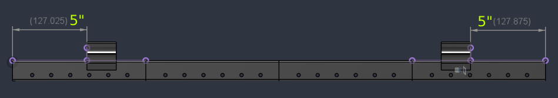

Line the C-clips up to be 5" (127mm used as rough guide) from either end of the rail. Apply a ream of the marine silicone adhesive sealant on the inside of each joining face of the C-clip. Press together firmly and let dry.

## 5. Cut and fold the basket netting

We made our basket from garden/plant-safe netting, cut from a flat pattern and folded into shape. Other materials can be used, but remember this will be mainly used for trash collection with constant water flow.

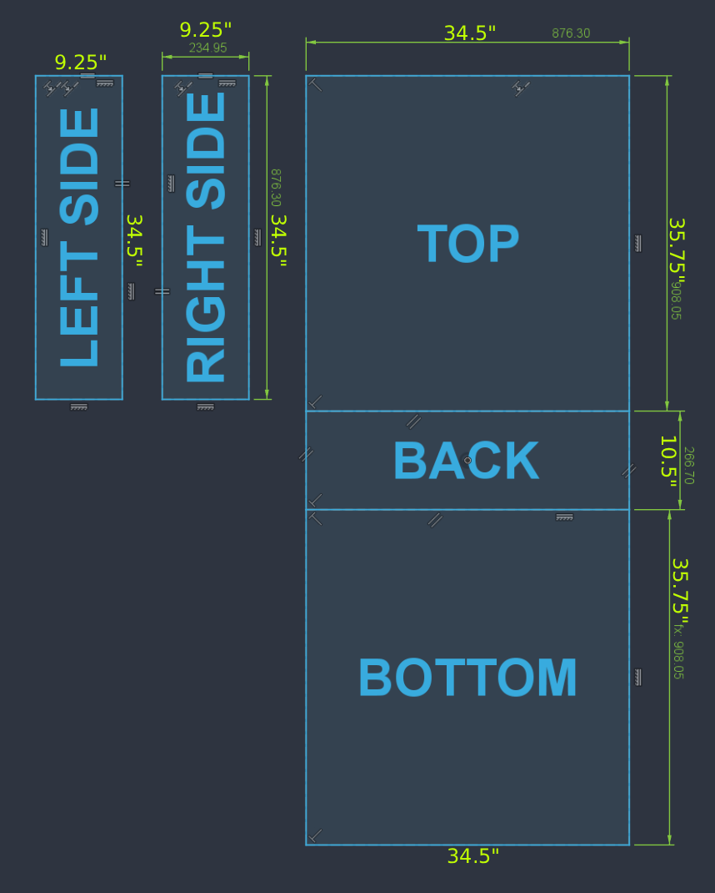

Cut the netting to this pattern with the given dimensions in the image above. The dimensions are also listed below:

| Face | Length (vertical) | Width (horizontal) |
|---|---|---|
| Top/Bottom | 35.75" | 34.5" |
| Back | 10.5" | 34.5" |
| Left/Right Side | 34.5" | 9.25" |

Fold along the seams shown above into the basket shape. The sides are not attached via the folds and are solely zip-tied to the rails.

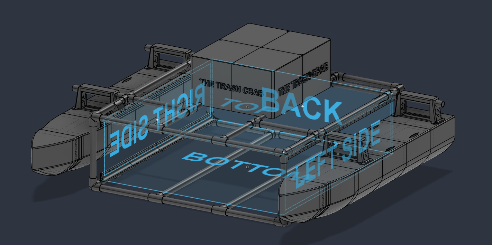

Attach the folded basket to the rail clips with zip-ties, positioned as shown.

## 6. Assemble the components box and finish

The components box holds the electronics and splits into a lid and base.

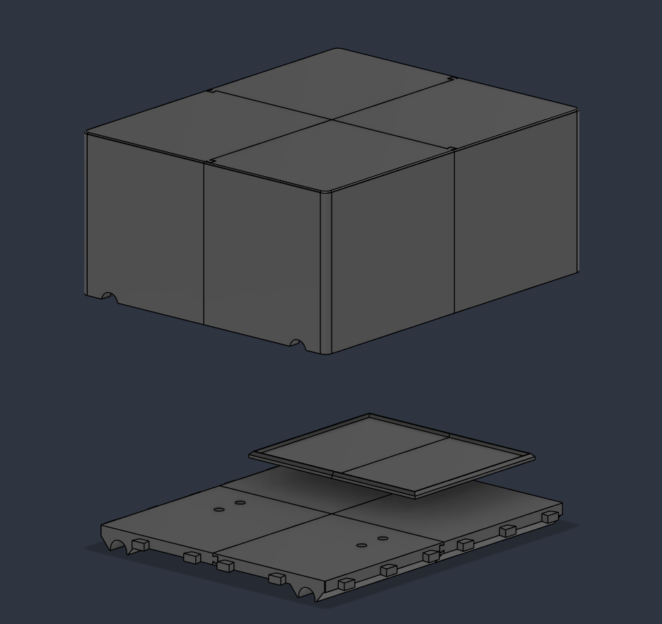

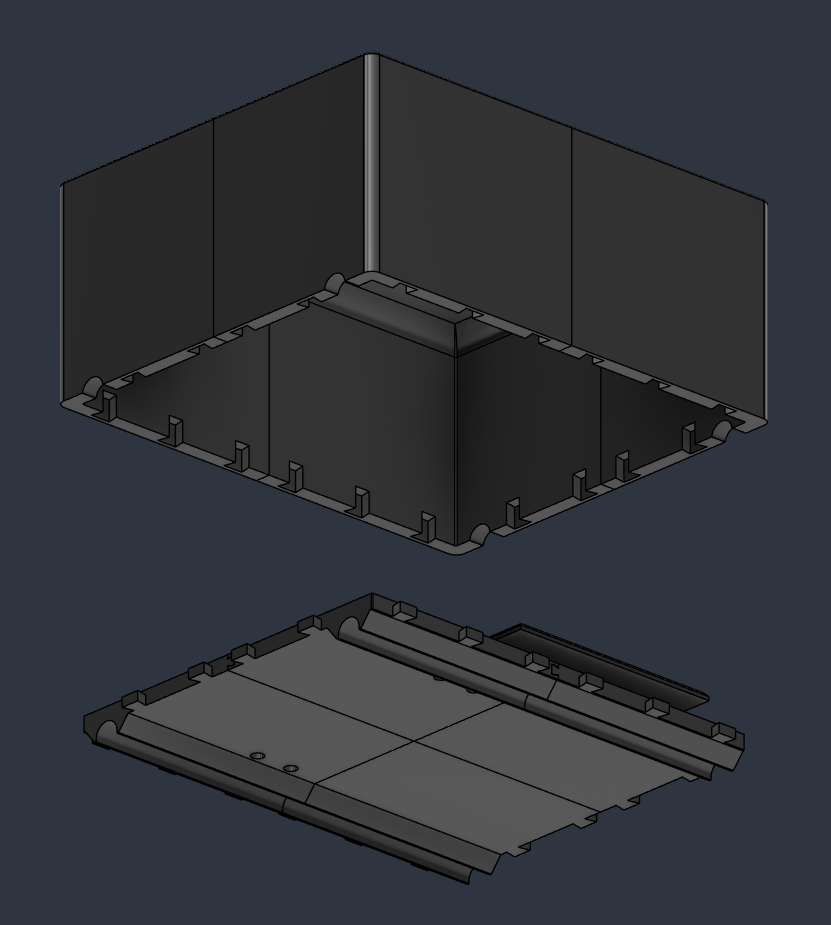

The plates and lid pieces each connect into their respective components via dovetail notches. Each female-side dovetail notch should be lined with some marine silicone adhesive sealant before attaching the pieces.

The plate starts as four pieces which attach in pairs of two, along the short-side dovetail notch to create the left/right sides. These then attach together along the long-side dovetail notch. 

The lid attaches in a spiral fashion with each dovetail notch locking the sides together.

Once all pieces of each component are sealed together, it is recommended to add a ream along the outer seams, similar to what was done when initially sealing the hulls, to ensure a strong connection.

Wire up the electronics inside the base before closing the lid. It slots right onto the plate and sinks down onto it via the dovetail slots on its outer edge. See the main README for the Pi/Arduino/GPS wiring.

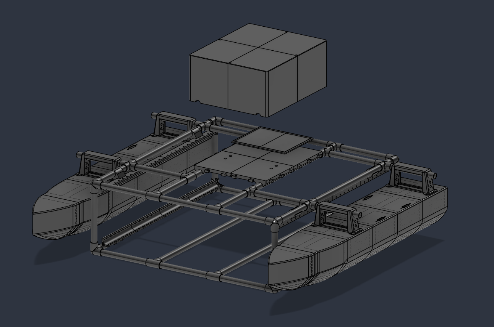

Mount the box to the frame at the back-middle of the bot with the main battery plate closest to the center for weight distribution. The plate attaches onto the inner PVC pipes running down the center of the top portion of the frame via its C-clips along its bottom.

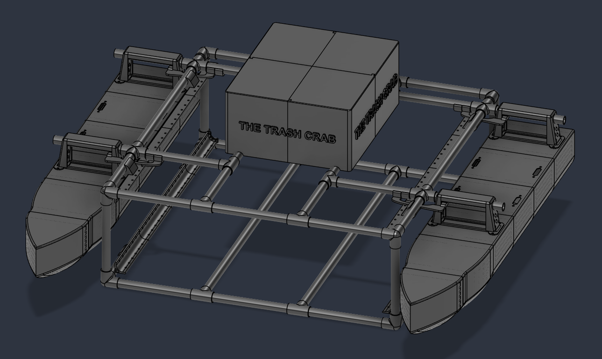

With the box closed, the build is complete. Continue with the [Getting started](../README.md#getting-started) section of the main README to flash the Arduino and bring the electronics online.

Congrats on creating your very own Trash Crab, and thank you for the faith you have placed in this guide as you do so.